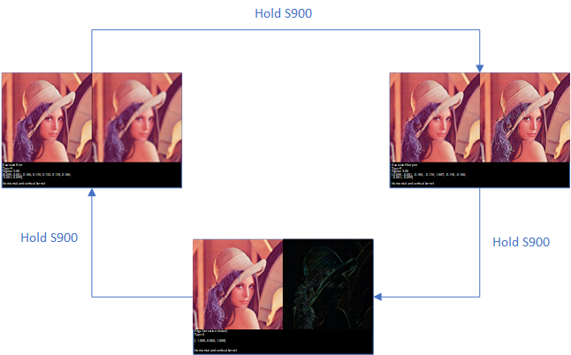
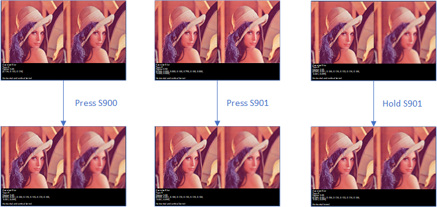
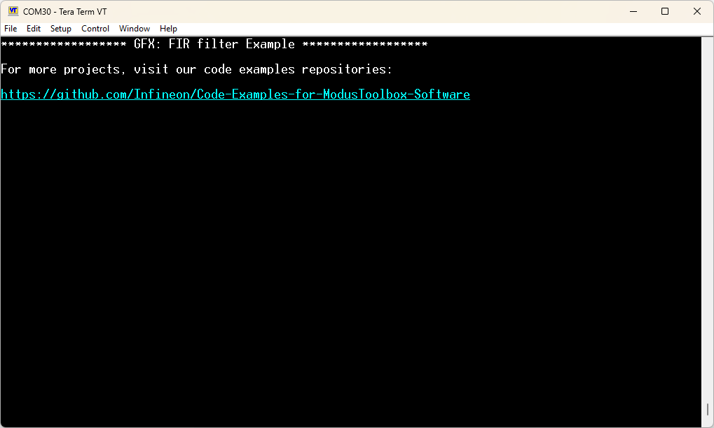
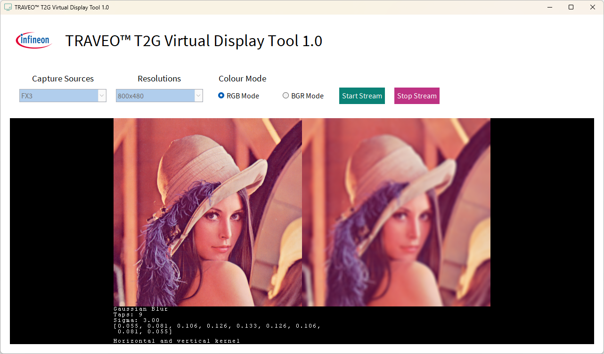

# Graphics FIR  example for graphics middleware

**This example shows how to use FIR filter with the graphics middleware. FIR filters can be used to achieve various effects at run time.**

The drivers used or available in this code example are listed below.
- [Graphics Driver for TRAVEO™ T2G cluster series user guide](https://myicp.infineon.com/sites/TRAVEODocumentation/Lists/defaultdoclib/Forms/AllItems.aspx?RootFolder=%2Fsites%2FTRAVEODocumentation%2FLists%2Fdefaultdoclib%2FTraveo%20II%2FTraveo%20II%20Cluster%2FGraphics&FolderCTID=0x01200023F2B2CA20D58647B6BFDE768454209B&View=%7BC8DBE6BD%2D4E7B%2D49A9%2D9267%2D2F926C13CB27%7D)
  - Chpater 4: Modules
  - Chapter 5: Classes
> **Note:** The above document are available on the myInfineon Collaboration Platform (MyICP). If not already available, please create a myInfineon account on [www.infineon.com](http://www.infineon.com/). Then, contact traveo@infineon.com and request access to TRAVEO™ T2G myICP.


- [JPEG decode driver user guide (TRAVEO™ T2G cluster series)](https://www.infineon.com/assets/row/public/documents/10/44/infineon-traveo-t2g-jpeg-decode-user-guide-usermanual-en.pdf?fileId=8ac78c8c8c3de074018c816028cf0ca8)
  - Chapter 2: JPEG decode driver

## Device

The device used in this code example (CE) is:
- [TRAVEO™ T2G CYT4DN Series](https://www.infineon.com/products/microcontroller/32-bit-traveo-t2g-arm-cortex/for-cluster/t2g-cyt4dn)

## Board

The board used for testing is:
- TRAVEO™ T2G Cluster 6M Lite Kit ([KIT_T2G_C-2D-6M_LITE](https://www.infineon.com/cms/en/product/evaluation-boards/kit_t2g_c-2d-6m_lite/))

## Scope of work

This code example applies various FIR filters on an image and shows the result compared with the original on the display. The filters used are a Gaussian blur, Gaussian sharpening and a Sobel edge detection filter.

The original image is always shown on the left. The image with the applied filter is shown on the right. At all times information about the current filter are printed on the bottom. Pressing or holding the buttons on the board change properties of the filter.

## Introduction

### FIR Filter

FIR stands for *Finite Impulse Response* which means that an FIR filter settles in a finite amount of time and requires no feedback for stability. Contrary, IIR filter, standing for *Infinite Impulse Response*, has an impulse response that does not settle to zero. They often require feedback or must assure that the impulse response, even though not zero, is negligible small.

FIR filters are often used in image processing.

### Mathematical background

To apply an FIR filter, the convolution operator is used:

<p align="center">

</p>

Here, x[n] is our signal and respectively one row or column of our image. h[n] is the FIR filter, often called *kernel*. The coefficients of the filter are commonly called *taps*. With above notation, the kernel has a size of 2N+1, whereby N is a natural number (an explanation follows why it is defined that way). 

Following is an example calculation where the filter is of size 3 (and thus N=1) and the signal, for sake of briefness, is also of size 3. Only integers are used to make the calculations simple - floats are allowed and typically used:

<p align="center">

</p>

Calculating element y[1] with the formula is not a problem. We cannot determine y[0] and y[2] since we have to access elements of the signal which do not exist (x[-1] and x[3]). To solve this issue a rule must be followed for these elements. In general, N elements to the left and right side of the original signal must be accessed (therefore we specify the kernel size as 2N+1). These rules are called *padding* because we add elements outside of the signal. Two common padding rules are:

- Zero-padding
- Same-padding

In former, all elements outside of the signal are set to zero. This means in our example x[-1] = x[3] = 0. Latter repeats the value last seen on the border. In our example x[-1] = x[0] = 1 and x[3] = x[2] = 3.

To summarize, the convolution operator does a multiply-and-accumulate operation on two arrays. One can imagine the kernel moving over the signal and adding all values.

### FIR Filter on TRAVEO™ T2G Cluster

TRAVEO™ T2G Cluster supports two one-dimensional FIR filter, one in horizontal and one in vertical direction, both with a maximum tap size of 15. They are working only in *Image Based Operation* (IBO) mode.

From the driver side, following function can be used to apply a filter:

```c
CYGFX_ERROR CyGfx_CmSetFilter (CYGFX_CM_HANDLE pHandle, CYGFX_CM_FILTER_CHANNEL eChannel, CYGFX_U08 fir_exponent, CYGFX_U08 taps_h, const CYGFX_S08* fir_coefficients_h, CYGFX_U08 taps_v, const CYGFX_S08* fir_coefficients_v )
```

Instead of providing float arrays, an exponent and signed byte arrays are used. The reason is that the filter unit works internally with fixed point numbers.

To make the usage easier, the utility library provides a function:

```c
CYGFX_ERROR utFilterSetFilter (CYGFX_BE_CONTEXT beCtx, CYGFX_CM_FILTER_CHANNEL eChannel, CYGFX_U08 taps_h, const CYGFX_FLOAT* fCoefficients_h, CYGFX_U08 taps_v, const CYGFX_FLOAT* fCoefficients_v, CYGFX_BOOL bNormalize)
```

This function takes float arrays, calculates the required exponent and signed byte arrays and calls CyGfx_CmSetFilter().

If you want to change the padding rule, you must set it in the context:

```c
// Available padding modes:
// CYGFX_BE_TILE_FILL_CONSTANT
// CYGFX_BE_TILE_FILL_ZERO
// CYGFX_BE_TILE_PAD
// CYGFX_BE_TILE_PAD_ZERO
CyGfx_BeSetAttribute(ctx, CYGFX_BE_SURF_ATTR_TILE_MODE, CYGFX_BE_TILE_PAD);
```

### General Use-Cases

FIR filters can be used in many ways. Complex effects can be achieved by concatenation. Three possible use-cases are:

- Blurring
- Sharpening
- Edge Detection


## Hardware setup

This CE has been developed for:
- TRAVEO™ T2G Cluster 6M Lite Kit ([KIT_T2G_C-2D-6M_LITE](https://www.infineon.com/cms/en/product/evaluation-boards/kit_t2g_c-2d-6m_lite/))

*Figure 1. KIT_T2G_C-2D-6M_LITE (Top View)*


No changes are required from the board's default settings.

## Implementation

### STDOUT/STDIN setting

UART is initialized to print information if an error happens. Additionally, it prints when a button press/hold is detected.

Initialization of the GPIO for UART is done in the <a href="https://infineon.github.io/retarget-io/html/group__group__board__libs.html#gaddff65f18135a8491811ee3886e69707"><i>cy_retarget_io_init()</i></a> function.
- Initializes the pin specified by *CYBSP_DEBUG_UART_TX* as UART TX and the pin specified by *CYBSP_DEBUG_UART_RX* as UART RX (these pins are connected to KitProg3 COM port)
- The serial port parameters are 8N1 and 115200 baud

### Description

As a general remark, this code example uses four windows:

- Background
- Original image
- Filtered image
- Status text

We focus on the filtering part in this description but feel free to investigate the code to see how the other parts are realized.

### Mode of Operation

This code example has three different states which can be switched by holding the S900 button. Following figure visualizes these states:

<p align="center"><i>Figure 2. Mode of operation</i></p>
<p align="center">

</p>

First state is a blurring filter - here a Gaussian blur filter is used. Holding S900 for around one second switches to the sharpening filter, where a Gaussian sharpening filter is applied. Third and last state is edge detection by utilizing a Sobel filter.

There are additional features available by pressing the other buttons which are shown in following figure:

<p align="center"><i>Figure 3. Additional button functionality</i></p>
<p align="center">

</p>

Pressing S900 increases the number of taps of the kernel by 2. The range is from 3 to 15 and only odd values are possible. These are restrictions by the hardware.

Pressing S901 works only with the blurring and sharpening filter and increases the sigma value by 0.5. This is used to calculate the filter and determines the amount of blurriness/sharpness. Sigma ranges from 0.5 to 5.0. The edge detection value does not use this value; hence nothing will change in this state.

Holding S901 for around one second dictates in which directions the filter is applied. It can be either horizontal, vertical or in both directions.

### State 1: Blurring

**Behavior:** Calculates a Gaussian blur filter and applies it to the image. 

**Code:**

```c
CYGFX_FLOAT coefficients[15];

calcGauss(coefficients, taps, sigma);
filterApply(taps, coefficients, CYGFX_TRUE)
printInfo("Gaussian Blur", taps, sigma, coefficients)
```

**Explanation:** First step is calling the function *calcGauss()*. The code was copied from the utility library function *utCalculate1DGauss()* to make the code example more accessible. This function calculates the blur filter according to a Gaussian bell curve. Afterwards, the applyFilter() function sets the filter in either horizontal, vertical or both directions, depending on the state of the button presses. *printInfo()* renders a status message on the display.

*Remark: If you want to use a Gaussian blur filter in both directions, you can directly use the function utFilterSetGaussFilter().*

### State 2: Sharpening

**Behavior:** Calculates a Gaussian sharpening filter and applies it to the image.

**Code:**

```c
CYGFX_FLOAT coefficients[15];

calcGauss(coefficients, taps, sigma);
CYGFX_U08 taps_mid = (taps - 1) >> 1;
for (int i = 0; i < taps; i++)
{
   coefficients[i] = -coefficients[i];
   if (i == taps_mid)
   {
      coefficients[i] += 2.0f;
   }
}

filterApply(taps, coefficients, CYGFX_TRUE);

printInfo("Gaussian Sharpen", taps, sigma, coefficients);
```

**Explanation:** The code is mostly the same as before. To calculate a Gaussian sharpening filter, one first calculates the Gaussian Blur filter and then negates all values but the value in the middle, where a 2 has to be added.

*Remark: If you want to use a Gaussian sharpening filter in both directions, you can directly use the function utFilterSetGaussSharpen(). There is also a Laplace sharpening filter available with utFilterSetLaplaceSharpen().*

### State 3: Edge Detection

**Behavior:** Utilizes a Sobel filter for edge detection.

**Code:**

```c
CYGFX_FLOAT coefficients[3] = { -1.f, 0.f, 1.f };

filterApply(3, coefficients, CYGFX_FALSE);

printInfo("Edge Detection (Sobel)", 3, -1.f, coefficients);
```

**Explanation:** A Sobel filter consists of the three-element kernel [-1, 0, 1]. In *applyFilter()* we do not normalize the values. When normalizing, the effect is difficult to see.

*Remark: Be sure that you do not apply the Sobel filter on the alpha channel. If you have an image with constant alpha value of 255, the Sobel filter sets all alpha values to 0 and no image is visible.*

## Run and Test

For this code example, a terminal emulator is required for displaying debug outputs. Install a terminal emulator if you do not have one. Instructions in this document use [Tera Term](https://teratermproject.github.io/index-en.html).

You need to download [TRAVEO™ T2G Virtual Display Tool](https://softwaretools-preview.icp.infineon.com/tools/com.ifx.tb.tool.traveot2gvirtualdisplaytool) in advance. The graphics example uses the FX3 controller to display the content via USB.

After code compilation, perform the following steps for flashing the device:
1. **Power and Connection Setup:**
   - Connect USB 3.0 Type-C cable between KitProg3 connector (X400) and PC USB port
   - Connect USB 3.0 Type-C cable between EZ-USB™ FX3 connector (X500) and PC USB port
      - *Note: one USB connection is sufficient when it is not required to observe the UART output at the same time as the display. For flashing, debugging and UART, use the KitProg3 connector (X400). For display output, use the EZ-USB™ FX3 connector (X500).*
   - Verify power LEDs are illuminated (D400, D104, D102, D103)

2. **UART output Setup:**
   - Open a terminal program and select the KitProg3 COM port
   - Set the serial port parameters to 8N1 and 115200 baud
   - Press MCU reset button (S200) if needed

3. **Program the Device:**
   - Select the code example project in the Project Explorer
   - In the **Quick Panel**, scroll down, and click **[Project Name] Program (KitProg3_MiniProg4)**

4. **Verify Operation:**
   - After programming, the code example starts automatically
   - Confirm that the messages are displayed on the UART terminal:

   *Figure 4. Terminal output on program startup*
   


5. **Graphics Output via FX3:**
   - Graphics data is transmitted through the EZ-USB™ FX3 interface (X500)
   - Open the TRAVEO™ T2G Virtual Display Tool
      - Under Capture Sources select **FX3**
      - Under Resolutions select **800x480**
      - Under Colour Mode select **RGB Mode**
      - Click on **Start Stream**
   - Output is following:

   *Figure 5. Visual output*



6. You can debug the example to step through the code. In the IDE, use the **[Project Name] Debug (KitProg3_MiniProg4)** configuration in the **Quick Panel**. For details, see the "Program and debug" section in the [Eclipse IDE for ModusToolbox™ software user guide](https://www.infineon.com/assets/row/public/documents/30/44/infineon-modustoolbox-eclipse-ide-user-guide-usermanual-en.pdf?fileId=8ac78c8c8929aa4d0189bd07dd6113f9).

**Note:** **(Only while debugging)** On the CM7 CPU, some code in *main()* may execute before the debugger halts at the beginning of *main()*. This means that some code executes twice: once before the debugger stops execution, and again after the debugger resets the program counter to the beginning of *main()*. See [KBA231071](https://community.infineon.com/t5/Knowledge-Base-Articles/PSoC-6-MCU-Code-in-main-executes-before-the-debugger-halts-at-the-first-line-of/ta-p/253856) to learn about this and for the workaround.

## References

Relevant Application notes are:
- [AN235305](https://www.infineon.com/assets/row/public/documents/10/42/infineon-an235305-getting-started-with-traveo-t2g-family-mcus-in-modustoolbox-applicationnotes-en.pdf) - Getting started with TRAVEO™ T2G family MCUs in ModusToolbox™

ModusToolbox™ is available online:
- <https://www.infineon.com/modustoolbox>
- [Graphics Driver for TRAVEO™ T2G cluster series user guide](https://myicp.infineon.com/sites/TRAVEODocumentation/Lists/defaultdoclib/Forms/AllItems.aspx?RootFolder=%2Fsites%2FTRAVEODocumentation%2FLists%2Fdefaultdoclib%2FTraveo%20II%2FTraveo%20II%20Cluster%2FGraphics&FolderCTID=0x01200023F2B2CA20D58647B6BFDE768454209B&View=%7BC8DBE6BD%2D4E7B%2D49A9%2D9267%2D2F926C13CB27%7D)
- [JPEG decode driver user guide (TRAVEO™ T2G cluster series)](https://www.infineon.com/assets/row/public/documents/10/44/infineon-traveo-t2g-jpeg-decode-user-guide-usermanual-en.pdf?fileId=8ac78c8c8c3de074018c816028cf0ca8)

ModusToolbox™ Graphics middleware is available online:
- <https://github.com/Infineon/tviic2d-gfx-mw>

Associated TRAVEO™ T2G MCUs can be found on:
- <https://www.infineon.com/cms/en/product/microcontroller/32-bit-traveo-t2g-arm-cortex-microcontroller/>

More code examples can be found on the GIT repository:
- [TRAVEO™ T2G Code examples](https://github.com/orgs/Infineon/repositories?q=mtb-t2g-&type=all&language=&sort=)

For additional trainings, visit our webpage:  
- [TRAVEO™ T2G trainings](https://www.infineon.com/training/microcontroller-trainings)

For questions and support, use the TRAVEO™ T2G Forum:  
- <https://community.infineon.com/t5/TRAVEO-T2G/bd-p/TraveoII>  